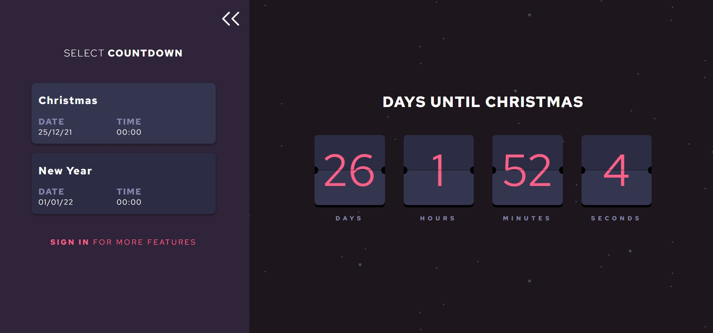

# Countdown app

A web-based app giving users the opportunity to create and manage multiple countdown events, allowing users to switch between them with ease and display personalised countdown clocks.

## Functionality

### Viewing countdown timer

The main function of the app is to view countdown timers which will tick down second by second until the date and time is reached. This can be viewed in the following video:

(_Eventually a flip motion design will be added to the countdown cards_)

### Signing up and signing in

Users can create new accounts which is done with a username and password (at the moment no email is used). Then, with a valid username and password, a user can sign in which will give them access to their personalised countdowns.

### Creating a new countdown

Signed in users can create a new countdown, giving it a name, date and time. I will add a tool tip to advise the user that if no time is needed (for example for whole day events) then they should set the time as 00:00.

### Selecting and viewing your countdowns

After creating countdowns, these will be displayed in the sidebar. By clicking on the card it will display the timer in the main clock area.

### Editing and deleting countdowns

Countdowns can be edited by clicking on the pencil icon on the countdown cards. The name, date and time can all be updated.

Countdowns can also be deleted by either clicking the bin icon on the countdown card, or when editing a countdown there is a delete button.

### Guest users

Users who don't wish to create an account have access to a limited range of countdowns that can be selected and viewed. These can't be edited or deleted.

I am considering giving guest users the option to create a single personalised countdown, however with no account this will be lost at the end of the session.

## Development Progress

This app is currently still in development, however the majority of front and back end functionality has been completed and successfully tested.

## Notes from the developer

This is my first attempt at building a fully functional, full-stack app that will be deployed to the web.

I have learnt a great deal, including how to effectively allow users to create new accounts as well as issuing JSON Web Tokens on a successful sign in attempt and use these to control access.

Many of these methods and technologies I have used before, however this is the first time I alone have created every aspect of a single app, from the UI, through to the API and database.

### Inspiration for the app

The initial designs for this app came from the [Launch Countdown Timer Frontend Mentor challenge](https://www.frontendmentor.io/challenges/launch-countdown-timer-N0XkGfyz-). However, as I was keen to take on more complex challenges I decided to use my creativity to evolve the site into something more substantial.

So, rather than a simple, single-page app that displays a single countdown timer, I evolved the designs so that the app contained greater functionality such as creating multiple personalised countdowns

To be able to save these countdowns accross sessions, a working backend was needed, which was perfect as I had been planning on create a full-stack app for a while.

### Areas identified for improvement

As this started out as a practice project, there are areas that we developed not necessarily following best practices - my belief is that whilst learning, it's better to spend the day writing bad code that works rather than spend the day reading about how to write the perfect code. However, as the project evolved, I identified the areas I need to improve on and learn more about.

There are a number of designs tweaks to be made as well as making the UI fully responsive for all screen sizes. I would also like to design an attractive landing page so that new users can learn about what the app does.

In addition to this, the handling of HTTP errors could be improved, both on the front and back end. This is something I plan to study more of so that I can use best practices later.

Throughout, there are areas that will need refactoring with the focus on removing unnecessary repeated code and implementing more elegant solutions. I have already identified further React components to create and slight changes to the Redux slices.

## Tech stack

- React
- Redux
- Node.js
- SQLite
